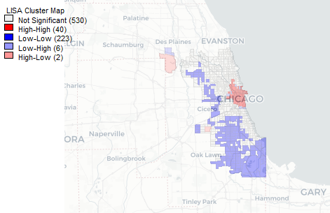
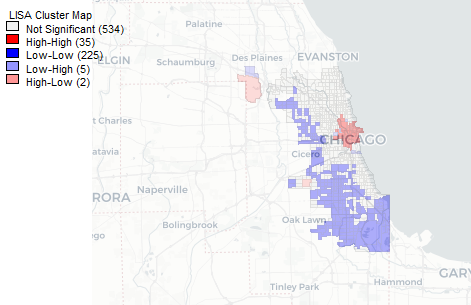
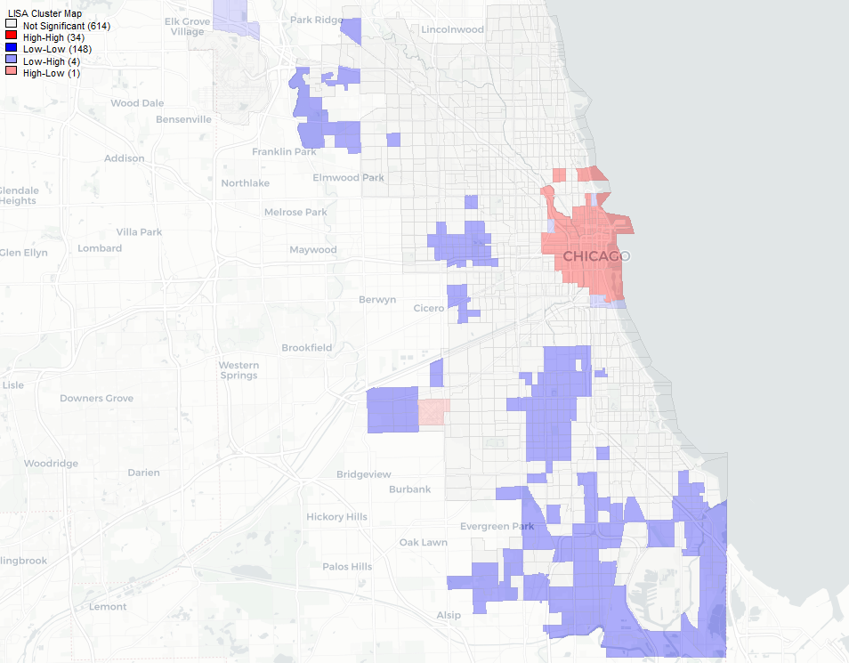
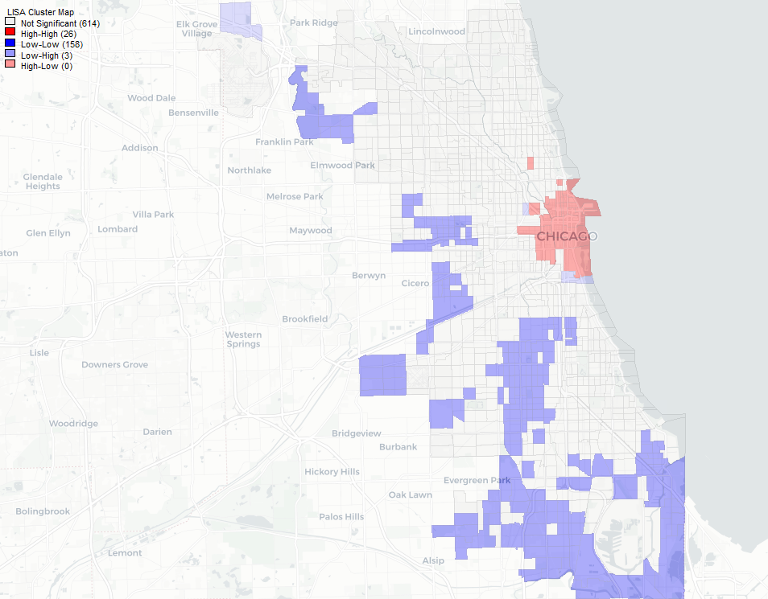

```{r setup, include=FALSE}
knitr::opts_chunk$set(echo = FALSE)
options(scipen = 999)
options(digits = 7)
#Loading libraries

library(tidyverse)
library(tmap)
library(lubridate)
library(tmaptools)
library(sf)
library(spdep)
library(spatstat)
library(rgdal)
library(viridis)
library(gridExtra)
library(rspatial)
library(plotly)
library(OpenStreetMap)
library(knitr)

#UserInput
CensusTracts <- "tl_2018_17_tract.shp"
ChicagoCensusTracts <- "ChicagoBoundaries.shp"
Rideshare_Chicago <- "ChicagoRideshareNovember2018.rds"
CountyFP <- as.character("031")
ReducedCalendarDays <- 1:7
k <- 4

#Reading data
Rideshare_Chicago <- read_rds(Rideshare_Chicago)
IL_CookCounty_CensusTracts <- read_shape(CensusTracts,
                              stringsAsFactors = F) %>%
  filter(COUNTYFP == CountyFP)
IL_CookCounty_CensusTracts <- IL_CookCounty_CensusTracts[!(IL_CookCounty_CensusTracts$TRACTCE == "990000"),]
ChicagoCensusTracts <- read_shape(ChicagoCensusTracts,
                                  stringsAsFactors = F)

#Shrinking data
ReducedRideshareChicago <- Rideshare_Chicago %>%
  mutate(Days = day(Trip.Start.Date),
         Trip.Seconds = str_replace_all(Trip.Seconds, ",", "") %>%
           as.numeric(),
         Trip.Minutes = round(Trip.Seconds/60,0),
         DaysofWeek = weekdays(Trip.Start.Date),
         isWeekend = "Weekday") %>%
  filter(Days %in% ReducedCalendarDays)
colnames(ReducedRideshareChicago)[1]<-"Trip.ID"
isWeekend <- function (df) {
  for (row in 1:nrow(df)){
    if (df[row,"DaysofWeek"] %in% c("Saturday","Sunday")){
      df[row,"isWeekend"] <- "Weekend"
    }
  }
  return(df)
}
ReducedRideshareChicago <- isWeekend(ReducedRideshareChicago)
```  

## Ride-sharing in Chicago

In this markdown, I will look at ride-sharing data provided by the city of Chicago, IL for the first week of November 2018. The entire data set up till May 2019 is approximately 6.5GB. In the interest of time and limited processing power, I decided to just look at the a small segment of the entire dataset, which in itself is not insignificant.  

Chicago (brown) is located in Cook County, IL as shown in the map below.   

```{r Map of Chicago, echo=FALSE}
IllinoisCookCountyMap <- tm_shape(IL_CookCounty_CensusTracts) + 
  tm_polygons(col = "#f2f2f2", alpha = 0.4)
ChicagoMap <- tm_shape(ChicagoCensusTracts) + 
  tm_polygons(col = "#e5d8bd", lcol = "white", alpha = 0.6)
IL_osm2 <- read_osm(IL_CookCounty_CensusTracts)
tm_shape(IL_osm2) +
  tm_rgb() +
  IllinoisCookCountyMap + 
  ChicagoMap + 
  tm_layout(main.title = "Map of Chicago in Cook County, IL",
            main.title.size = 1)
 
```

###Overview

The data provided by ride-sharing companies to the City of Chicago were anonymized in the following ways:  
1. Drop-off and pick-up locations correspond to US Census Bureau TIGER Census Tracts.  
2. Pick-up and drop-off times were rounded to the nearest 15 minute-interval.  
3. Fares and tips were rounded to the nearest $2.50 and $1.00 respectively.  
4. Names of the companies were hidden.
  
This was to protect the identity of riders. In about a third of all rides in November 2018, the identity of the rider(s) could still be determined after rounding times to the nearest 15 minute-interval and locations to the Census Tract. In these cases, the Census Tracts fields were left blank. These observations were eliminated from the following analyses.  
The census tract is an appropriate geographical scale as it is small enough such that local effects are not obscured. 

```{r Scatterplot of Rides , echo = FALSE, fig.width = 7, fig.height = 7}
SharedTrip.Labs <- c(false = "Unshared", true = "Shared")
RidesScatter <- ggplot(ReducedRideshareChicago, aes(x = Trip.Miles, y = Fare)) + 
  geom_point(alpha = 0.4, stroke = 0, aes(color = Trip.Minutes)) +
  labs(x = "Distance (mi)", y = "Fare ($)", title = "The Fare Game", fill = "Duration (min)") + 
  scale_color_viridis_c("Duration (min)") + 
  facet_grid(isWeekend~Shared.Trip.Authorized, 
             #nrow = 1,
             labeller = labeller(Shared.Trip.Authorized = SharedTrip.Labs))
RidesScatter
```

```{r Shared Rides, echo = FALSE}
SharedRides <- ReducedRideshareChicago %>%
  filter(Shared.Trip.Authorized == "true")
UnsharedRides <- ReducedRideshareChicago %>%
  filter(Shared.Trip.Authorized == "false")
```

The rideshare data appears to show some degree of heteroskedasticity when distance is plotted against fare for unshared rides. Heteroskedasticity can be explained by the fact that this dataset contains data from different ridesharing companies each deploying their own fare-calculation algorithms. interestingly, rides taken on weekends do not appear to be any more expensive than those on weekdays. The distributions are roughly identical. If anything, it appears that unshared rides on weekdays are most likely to be the most expensive out of the four types of rides compared above.    

More importantly, I am interested in the geographical distribution of riders in Chicago. Since unshared rides account for `r paste(round(nrow(UnsharedRides)/nrow(ReducedRideshareChicago)*100,2), "%", sep = "")` of rides in Chicago, and pooled rides appear to display very different fare chracteristics from non-pooled rides, I will only considered unshared rides in the following analyses.  

Grouping each trip by its pickup and dropoff census tract, a histogram for the frequency in which tract a passenger is picked up and dropped off from can be found. Both histograms demonstrate a significant right-skew with an extremely long tail. That is to say, most tracts experienced 50 or less pick-ups and drop-offs in the first week of November 2018.  

```{r pick up histogram}
PickupCount <- ReducedRideshareChicago %>%
  group_by(Pickup.Census.Tract, isWeekend) %>%
  summarize(Pickup = n_distinct(Trip.ID))%>%
  spread(isWeekend, Pickup)
colnames(PickupCount)[2:3]<- c("Weekday.Pickup", "Weekend.Pickup")
DropoffCount <- ReducedRideshareChicago %>%
  group_by(Dropoff.Census.Tract, isWeekend) %>%
  summarize(Dropoff = n_distinct(Trip.ID))%>%
  spread(isWeekend, Dropoff)
colnames(DropoffCount)[2:3]<- c("Weekday.Dropoff", "Weekend.Dropoff")
TractCounts <- full_join(PickupCount, DropoffCount, by = c("Pickup.Census.Tract" = "Dropoff.Census.Tract")) %>%
    mutate(Pickup = Weekday.Pickup + Weekend.Pickup,
         Dropoff = Weekday.Dropoff + Weekend.Dropoff) %>%
  transform(Pickup.Census.Tract = as.factor(Pickup.Census.Tract),
            Weekend.Pickup = round(Weekend.Pickup/2),
            Weekend.Dropoff = round(Weekend.Dropoff/2),
            Weekday.Pickup = round(Weekday.Pickup/5),
            Weekday.Dropoff = round(Weekday.Dropoff/5))
TractCounts[is.na(TractCounts)] <- 0
colnames(TractCounts)[1] <- "CensusTracts"
PickUpHist <- ggplot(TractCounts, aes(x = Pickup)) + 
  geom_histogram(binwidth = 50) + 
  labs(x = "Number of Pickups", y = "Number of Census Tracts")
DropoffHist <- ggplot(TractCounts, aes(x = Dropoff)) + 
  geom_histogram(binwidth = 50) + 
  labs(x = "Number of Dropoffs", y = "Number of Census Tracts") 
grid.arrange(PickUpHist, DropoffHist, ncol = 2, nrow = 1, top = "Histograms of Pickups and Dropoffs by Census Tracts")
```
   
```{r Thematic Mapping, message=FALSE, warning=FALSE}
TractCounts$CensusTracts <- as.character(TractCounts$CensusTracts)
Ridercounts <- left_join(ChicagoCensusTracts, TractCounts, by = c("geoid10" = "CensusTracts"))
Ridercounts[is.na(Ridercounts)] <- 0
```
Based on the `fivenum` summaries below, 75% of all census tracts had less than 50 pick-ups and drop-offs in the first 7 days of November 2018.

```{r fivenum}
fivenum(Ridercounts$Pickup)
fivenum(Ridercounts$Dropoff)
```

```{r Rider Counts, echo = FALSE}
RidercountsSorted <- Ridercounts %>%
  filter(Pickup > 47,
         Dropoff > 48) %>%
  summarize(TotalPickups = sum(Pickup),
            TotalDropoffs = sum(Dropoff))
```

In fact, `r paste(round(RidercountsSorted$TotalPickups/82680*100), "%", sep = "")` of all pickups and dropoffs occur within a quarter of all census tracts in Chicago. This suggests that there might not be Complete Spatial Randomness (CSR) where ride-share pickups and dropoffs in the City of Chicago are concerned.   

Plotting the *mean* number of pickups and dropoffs daily, there appears to be no difference in either the geographical distribution or relative intensity of concentration of ride-share activity. Rideshare activity is concentrated in the neighborless census tract that is Chicago O'Hare International Airport and downtown Chicago. Hence, in considering the spatial autocorrelaton of rideshare activity, there will be no differentiation between weekend and weekday rides.  

```{r Chicago Pickup, message=FALSE, warning=FALSE, echo = FALSE }
ORD_osm <- read_osm(ChicagoCensusTracts)
tm_shape(ORD_osm) +
  tm_rgb() +
  tm_shape(Ridercounts) + 
  tm_polygons(c("Weekday.Pickup", "Weekend.Pickup"), palette = "Oranges", alpha = 0.6) + 
  tm_layout(legend.position = c("left", "bottom"),
            main.title = "Mean Daily Pickups in Chicago",
            main.title.size = 1,
            legend.bg.color = "#bdbdbd",
            legend.bg.alpha = 0.7)
```

```{r Chicago Dropoff}
tm_shape(ORD_osm) + 
  tm_rgb() + 
  tm_shape(Ridercounts) + 
  tm_polygons(c("Weekday.Dropoff", "Weekend.Dropoff"), palette = "Oranges", alpha = 0.6) + 
  tm_layout(legend.position = c("left", "bottom"),
            main.title = "Mean Daily Dropoffs in Chicago",
            main.title.size = 1,
            legend.bg.color = "#bdbdbd",
            legend.bg.alpha = 0.7)
```

###Fare Analysis

Two spatial weight matrices were used: a first-order queen contiguity, and k-nearest neighbor (k = 4).  

Queen contiguity was selected as it is the more permissive of the two contiguity methods. This takes into account the effect of contiguity from all possible directions and border lengths, even if it is just a single vertex. However, census tracts come in different shapes and sizes. Compared to rook contiguity, the distance threshold for queen contiguity matrices are higher. In other words, distance decay is assumed to be less of an issue. Furthermore, given that street corners and intersections, upon which census tract boundaries are based, tend to be right angles. This increases the odds of two riders diagonally across each other at an intersection being classed into two separate census tracts. In cases like these, queen contiguity should be used.    

The second weight matrix is the k-nearest neighbor matrix where k = 4, an arbitrary number that should eliminate local noise from too low a k-value while still considering local effects, the latter of which might be obscured with a higher k-value. K-nearest neighbors was picked because of the uneven density of census tracts. Census tracts come in different shapes and sizes. It is not inconceivable for a parcel to have four contiguous neighbors. However, one if them is bigger than the next three combined. In such a situation, is it truly statistically precise to argue that points within the large tract experience the effect of distance decay to the same magnitude as those in the smaller, and closer tracts? Probably not. Further, there are neighborless tracts, such as the one containing Chicago O'Hare airport to the northwest of all other tracts, that are not adequately captured by contiguity-based spatial weight matrices. Finally, Tobler's first law of geography states that closer things are more related than farther ones. The concepts of "closer" and "farther" are relative to the size of the census tract. Thus, absolute distance thresholds are less suited for the uneven distribution of census tracts in Chicago; k-nearest neighbors remains one of the better options.   

####Queen Contiguity
A first-order row standardized queen contiguity spatial weights matrix was created. The census tracts file used to generate this matrix includes pick-up and drop-off numbers shown in the histogram above. 
```{r Queen Contiguity}
#Converting to sp object
Ridercounts.sp <- as(Ridercounts, "Spatial")
ChicagoWeights <- poly2nb(Ridercounts.sp, row.names = Ridercounts.sp$geoid10, queen = T)
ChicagoWeightsRSM <- nb2listw(ChicagoWeights, style = "W", zero.policy = T)
```

The Global Moran's I plot for pick-ups below shows a strong positive relationship between the number of pickups in a census tract and is neighboring census tracts. A strong positive relationship is evident with strong clustering in quadrants one and three, although the scatter in quadrant three is limited. This suggests that census tracts with a high number of pickups are more likely to be contiguous to other census tracts with a high number of pick-ups as well. In other words, the number of pick-ups in census tracts are spatially autocorrelated. The Moran's I value is `r  moran(Ridercounts.sp$Pickup, ChicagoWeightsRSM, n = length(ChicagoWeightsRSM$neighbours), S0 = Szero(ChicagoWeightsRSM))[1]` which is consistent with strong spatial autocorrelation. The results from a Monte Carlo simulation with 499 permutations and a p-value of 0.02 suggests that the outcome of the Moran's I test is statistically significant and unlikely to be random.   

*The `moran.plot` function was not used for aesthetic reasons*

```{r Global Queen Pickup}
Ridercounts.lag <- lag.listw(ChicagoWeightsRSM, Ridercounts.sp$Pickup) %>%
  scale() %>%
  as.vector()

ggplot() + 
  geom_point(mapping = aes(x = as.vector(scale(Ridercounts.sp$Pickup)), y = Ridercounts.lag)) + 
  geom_smooth(mapping = aes(x = as.vector(scale(Ridercounts.sp$Pickup)), y = Ridercounts.lag), method = "lm", se = F) + 
  geom_hline(yintercept = 0) + 
  geom_vline(xintercept = 0) +
  labs(x = "Pickups in Census Tract", y = "Lag of Pickups in Census Tract", title = "Pickups and Their Neighbors")
MonteCarloPickUpQueen <- moran.mc(Ridercounts.sp$Pickup, ChicagoWeightsRSM, nsim = 499)
MonteCarloPickUpQueen
plot(MonteCarloPickUpQueen, main = "", las=1)
```

```{r Local Queen Pickup, echo=FALSE, eval=FALSE}
Ridercounts2<-Ridercounts.sp
LMoran.Queen.Pickup <- localmoran(as.vector(scale(Ridercounts.sp$Pickup)), ChicagoWeightsRSM)
summary(LMoran.Queen.Pickup)
Ridercounts2$s_Pickup <- scale(Ridercounts2$Pickup) %>%
  as.vector()
Ridercounts2$lag_s_Pickup <- lag.listw(ChicagoWeightsRSM, Ridercounts2$s_Pickup)
Ridercounts2$quad_sig_q_pickup <- NA
Ridercounts2[(Ridercounts2$s_Pickup >= 0 &
              Ridercounts2$lag_s_Pickup >= 0) &
              (LMoran.Queen.Pickup[,5] <= 0.05), 
            "quad_sig_q_pickup"] <- "High-High"
Ridercounts2[(Ridercounts2$s_Pickup <= 0 &
              Ridercounts2$lag_s_Pickup <= 0) &
              (LMoran.Queen.Pickup[,5] <= 0.05), 
            "quad_sig_q_pickup"] <- "Low-Low"
Ridercounts2[(Ridercounts2$s_Pickup >= 0 &
              Ridercounts2$lag_s_Pickup <= 0) &
              (LMoran.Queen.Pickup[,5] <= 0.05), 
            "quad_sig_q_pickup"] <- "High-Low"
Ridercounts2[(Ridercounts2$s_Pickup <= 0 &
              Ridercounts2$lag_s_Pickup >= 0) &
              (LMoran.Queen.Pickup[,5] <= 0.05), 
            "quad_sig_q_pickup"] <- "Low-High"
Ridercounts2[(LMoran.Queen.Pickup[,5] > 0.05), 
            "quad_sig_q_pickup"] <- "Not Signif"
Ridercounts2$quad_sig_q_pickup <- Ridercounts2$quad_sig_q_pickup %>%
  as.factor()

tm_shape(Ridercounts2) + 
  tm_polygons("quad_sig_q_pickup")
```

Repeating the same for drop-offs, the Moran's I value is `r  moran(Ridercounts.sp$Dropoff, ChicagoWeightsRSM, n = length(ChicagoWeightsRSM$neighbours), S0 = Szero(ChicagoWeightsRSM))[1]` which is consistent with strong spatial autocorrelation.

```{r Queen Dropoff}
RidercountsDropoff.lag <- lag.listw(ChicagoWeightsRSM, Ridercounts.sp$Dropoff) %>%
  scale() %>%
  as.vector()
ggplot() + 
  geom_point(mapping = aes(x = as.vector(scale(Ridercounts.sp$Dropoff)), y = RidercountsDropoff.lag)) + 
  geom_smooth(mapping = aes(x = as.vector(scale(Ridercounts.sp$Dropoff)), y = RidercountsDropoff.lag), method = "lm", se = F) + 
  geom_hline(yintercept = 0) + 
  geom_vline(xintercept = 0) +
  labs(x = "Dropoffs in Census Tract", y = "Lag of Dropoffs in Census Tract", title = "Dropoffs and Their Neighbors")
```

```{r Queen Dropoff 2}
MonteCarloDropoffQueen <- moran.mc(Ridercounts.sp$Dropoff, ChicagoWeightsRSM, nsim = 499)
MonteCarloDropoffQueen
```

```{r Queen Dropoff 3}
plot(MonteCarloDropoffQueen, main = "", las=1)
```

Pivoting to the Local Indicator of Spatial Association (LISA) for pickups and dropoffs in Chicago using Geoda, the following significance maps can be derived.

```{r fig.height=6, fig.width=6, out.width="70%"}

```

```{r fig.height=6, fig.width=6, out.width="70%"}

```

Unsurprisingly, for both pickups and dropoffs, census tracts with a high level of ridership in downtown Chicago are co-located and surrounded by census tracts that report similarly high number of pickups and dropoffs. More interestingly, about a quarter of all census tracts report low levels of ridership and are equally surrounded by low levels of ridership. These low-low tracts are substantially more significant that the high-high. This suggest that the leverage of the high-high tracts may have skewed the Moran's I results. 

```{r Local Queen Dropoff, echo=FALSE, eval=FALSE}
Ridercounts2<-Ridercounts
LMoran.Queen.Dropoff <- localmoran(Ridercounts$Dropoff, ChicagoWeightsRSM)
summary(LMoran.Queen.Dropoff)
Ridercounts2$s_Dropoff <- scale(Ridercounts2$Dropoff) %>%
  as.vector()
Ridercounts2$lag_s_Dropoff <- lag.listw(ChicagoWeightsRSM, Ridercounts2$s_Dropoff)
Ridercounts2$quad_sig_q_Dropoff <- NA
Ridercounts2[(Ridercounts2$s_Dropoff >= 0 &
              Ridercounts2$lag_s_Dropoff >= 0) &
              (LMoran.Queen.Dropoff[,5] <= 0.05), 
            "quad_sig_q_Dropoff"] <- "High-High"
Ridercounts2[(Ridercounts2$s_Dropoff <= 0 &
              Ridercounts2$lag_s_Dropoff <= 0) &
              (LMoran.Queen.Dropoff[,5] <= 0.05), 
            "quad_sig_q_Dropoff"] <- "Low-Low"
Ridercounts2[(Ridercounts2$s_Dropoff >= 0 &
              Ridercounts2$lag_s_Dropoff <= 0) &
              (LMoran.Queen.Dropoff[,5] <= 0.05), 
            "quad_sig_q_Dropoff"] <- "High-Low"
Ridercounts2[(Ridercounts2$s_Dropoff <= 0 &
              Ridercounts2$lag_s_Dropoff >= 0) &
              (LMoran.Queen.Dropoff[,5] <= 0.05), 
            "quad_sig_q_Dropoff"] <- "Low-High"
Ridercounts2[(LMoran.Queen.Dropoff[,5] > 0.05), 
            "quad_sig_q_Dropoff"] <- "Not Signif"
Ridercounts2$quad_sig_q_Dropoff <- Ridercounts2$quad_sig_q_Dropoff %>%
  as.factor()

tm_shape(Ridercounts2) + 
  tm_polygons("quad_sig_q_Dropoff")
```

####K-Nearest Neighbor (k = 4)

By selecting the four nearest neighbors of each census tract, a connectivity map of Chicago's census tracts can be generated, as seen below. In this instance, even non-contiguous exclaves such as the census tract that Chicago O'Hare International Airport sits on are connected with other tracts. The global Moran's I value from the k-nearest neighbor analysis is 0.56184. This is weaker than the results returned by the contiguity matrix. However, the results remain statistically significant and strongly suggest that autocorrelation is present. 


```{r knn}
#Long and Lat of Centroid of Census Tract
Ridercounts3 <- inner_join(Ridercounts, as.data.frame(IL_CookCounty_CensusTracts), by = c("geoid10" = "GEOID"))
#LongLat required for KNN analysis
ChicagoCensusTractsLongLat <- cbind(as.numeric(Ridercounts3$INTPTLON), as.numeric(Ridercounts3$INTPTLAT)) %>%
  as.matrix()
#Calculating KNN and returning nb object
ChicagoWeightsKNN <- knearneigh(ChicagoCensusTractsLongLat, k, longlat = T)
ChicagoKNN <- knn2nb(ChicagoWeightsKNN)
#Plotting connectivity map
#tmap does not support nb object
Ridercounts4<-Ridercounts[,4]
plot(Ridercounts4, col= "#f7f7f7",reset = F, main = "Connectivity Map (k = 4)")
plot(ChicagoKNN,ChicagoCensusTractsLongLat, add = T, col = "#fbb4ae", cex = 0.5)
#Converting to matrices
ChicagoKNNM <- nb2mat(ChicagoKNN)
ChicagoKNNRSM <- nb2listw(ChicagoKNN)
```


```{r knn Pickup}
RidercountsPickup.lag.KNN <- lag.listw(ChicagoKNNRSM, Ridercounts.sp$Pickup) %>%
  scale() %>%
  as.vector()
ggplot() + 
  geom_point(mapping = aes(x = as.vector(scale(Ridercounts.sp$Pickup)), y = RidercountsPickup.lag.KNN)) + 
  geom_smooth(mapping = aes(x = as.vector(scale(Ridercounts.sp$Pickup)), y = RidercountsPickup.lag.KNN), method = "lm", se = F) + 
  geom_hline(yintercept = 0) + 
  geom_vline(xintercept = 0) +
  labs(x = "Pickups in Census Tract", y = "Lag of Pickups in Census Tract", title = "Pickups and Their k-Nearest Neighbors")


#moran.plot(Ridercounts$Pickup, ChicagoKNNRWM)
MonteCarloPickUpKNN <- moran.mc(Ridercounts$Pickup, ChicagoKNNRSM, nsim = 499)
MonteCarloPickUpKNN
plot(MonteCarloPickUpKNN, main = "", las=1)
```

Similarly, the geographical concentration of dropoffs is more likely than not to be autocorrelated. These results are statistically significant as proven by the Monte Carlo simulation. 

```{r knn dropoff}
RidercountsDropoff.lag.KNN <- lag.listw(ChicagoKNNRSM, Ridercounts.sp$Dropoff) %>%
  scale() %>%
  as.vector()
ggplot() + 
  geom_point(mapping = aes(x = as.vector(scale(Ridercounts.sp$Dropoff)), y = RidercountsDropoff.lag.KNN)) + 
  geom_smooth(mapping = aes(x = as.vector(scale(Ridercounts.sp$Dropoff)), y = RidercountsDropoff.lag.KNN), method = "lm", se = F) + 
  geom_hline(yintercept = 0) + 
  geom_vline(xintercept = 0) +
  labs(x = "Dropoffs in Census Tract", y = "Lag of Dropoffs in Census Tract", title = "Dropoffs and Their k-Nearest Neighbors")


#moran.plot(Ridercounts$Pickup, ChicagoKNNRWM)
MonteCarloDropoffKNN <- moran.mc(Ridercounts.sp$Dropoff, ChicagoKNNRSM, nsim = 499)
MonteCarloDropoffKNN
plot(MonteCarloPickUpKNN, main = "", las=1)
```

```{r fig.height=6, fig.width=6, out.width="70%"}

```

```{r fig.height=6, fig.width=6, out.width="70%"}

```

```{r Spatial Polygons Conversion, echo = FALSE, warning=FALSE, message=FALSE, eval = F}
RiderCountsSpatialPolygons <- as(Ridercounts, "Spatial")
writeOGR(obj=RiderCountsSpatialPolygons, dsn="./RiderCounts", layer="Chicago Rideshare", driver="ESRI Shapefile", overwrite_layer = T)
```

The two LISA cluster maps are similar to the LISA cluster maps drawn up based on a queen contiguity spatial weights matrix. Thus, the data lend themselves to the conclusion that rideshares cluster in downtown Chicago and suburbs to the south, regardless of day of week. The intense clustering of rideshare activity has more likely than not leveraged the Moran's I plot.  

####Discussion
Itis not entirely clear from the ridesharing dataset itself what is causing the clustering. Intuitively, it could be due to the concentration of economic activity and footfall within downtown Chicago that is causing these observations. A more in-depth study can be performed with the relevant economic data.  

Intriguingly, GeoDa and the `localmoran` function returned different results as to the significance of the observations of statistical clustering even though all the parameters selected and input were identical.

```{r Local knn Pickup, echo=FALSE, eval=FALSE}
Ridercounts4<-Ridercounts
LMoran.knn.Pickup <- localmoran(Ridercounts4$Pickup, ChicagoKNNRSM)
summary(LMoran.knn.Pickup)
Ridercounts4$s_Pickup <- scale(Ridercounts4$Pickup) %>%
  as.vector()
Ridercounts4$lag_s_Pickup <- lag.listw(ChicagoKNNRSM, Ridercounts4$s_Pickup)
Ridercounts4$quad_sig_k_pickup <- NA
Ridercounts4[(Ridercounts4$s_Pickup >= 0 &
              Ridercounts4$lag_s_Pickup >= 0) &
              (LMoran.knn.Pickup[,5] <= 0.05), 
            "quad_sig_k_pickup"] <- "High-High"
Ridercounts4[(Ridercounts4$s_Pickup <= 0 &
              Ridercounts4$lag_s_Pickup <= 0) &
              (LMoran.knn.Pickup[,5] <= 0.05), 
            "quad_sig_k_pickup"] <- "Low-Low"
Ridercounts4[(Ridercounts4$s_Pickup >= 0 &
              Ridercounts4$lag_s_Pickup <= 0) &
              (LMoran.knn.Pickup[,5] <= 0.05), 
            "quad_sig_k_pickup"] <- "High-Low"
Ridercounts4[(Ridercounts4$s_Pickup <= 0 &
              Ridercounts4$lag_s_Pickup >= 0) &
              (LMoran.knn.Pickup[,5] <= 0.05), 
            "quad_sig_k_pickup"] <- "Low-High"
Ridercounts4[(LMoran.knn.Pickup[,5] > 0.05), 
            "quad_sig_k_pickup"] <- "Not Signif"
Ridercounts4$quad_sig_k_pickup <- Ridercounts4$quad_sig_k_pickup %>%
  as.factor()

tm_shape(Ridercounts4) + 
  tm_polygons("quad_sig_k_pickup")
```

###Conclusion

These analyses further point towards how some areas rely on ridesharing companies, such as Uber and Lyft, a lot more than others. The question is why? Does this mean that rideshares are in competitive supply with other forms of private transportation, and public transit? Further, the high number of unshared rides and intense clustering of rideshare activity appears, at first glance, to support the argument that ridesharing companies have contributed to congestion, instead of alleviating it, as was their premise when they were first launched. Expandng on these analyses, a larger and longer dataset will provide more accurate results. Further, more data can also enable the reverse engineering of Uber and Lyft's fare algorithm.   